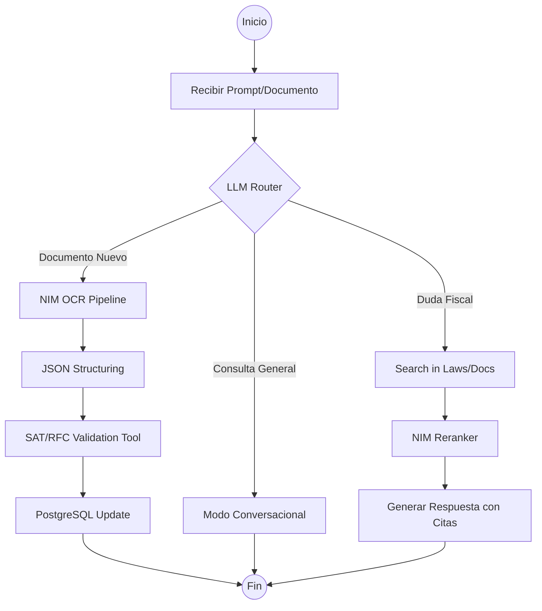

------

# Documento 1: Blueprint de Arquitectura Técnica (v2.0)

## Proyecto: IDP Asistente Contable IA-First

### 1. Resumen de la Nueva Filosofía

A diferencia de la versión anterior, que funcionaba como una aplicación de escritorio monolítica, la v2.0 se diseña como una **Arquitectura de Microservicios Orquestada por Agentes**. La inteligencia no es un complemento; es el motor que decide el flujo de datos.

### 2. Capas del Sistema (Stack Tecnológico)

| **Capa**              | **Componente**               | **Tecnología Seleccionada**                     |
| --------------------- | ---------------------------- | ----------------------------------------------- |
| **Frontend**          | Interfaz de Usuario          | React 18 + Vite + Tailwind CSS (Shadcn/UI).     |
| **Orquestación**      | Backend Core                 | FastAPI (Python 3.11) + LangGraph.              |
| **Capa de IA**        | Microservicios de Inferencia | **NVIDIA NIM** (Llama 3.3 70B, NeMo Retriever). |
| **Base de Datos**     | Persistencia Relacional      | PostgreSQL (con esquemas para Multi-tenancy).   |
| **Memoria Vectorial** | Búsqueda Semántica           | ChromaDB o pgvector (1024 dimensiones).         |
| **Mensajería**        | Tareas Asíncronas            | Redis + Celery (para procesamiento OCR masivo). |

------

### 3. Especificaciones de Modelos NVIDIA NIM

Para garantizar la máxima precisión fiscal y legal, el sistema se estandariza en los siguientes endpoints de NVIDIA:

1. **Generación de Texto (Cerebro):** `meta/llama-3.3-70b-instruct`
   - *Uso:* Razonamiento contable, planeación de tareas y generación de reportes.
2. **Embeddings (Vectorización):** `nvidia/nv-embedqa-e5-v5`
   - *Configuración:* 1024 dimensiones, métrica de similitud de coseno.
3. **Reranking (Precisión RAG):** `nvidia/nv-rerankqa-mistral-4b-v3`
   - *Uso:* Refinar los 5 mejores resultados de búsqueda en la ley federal (LISR).
4. **Extracción Multimodal (IDP):** `nvidia/ne-mo-retriever-ocr-v1`
   - *Uso:* Transformar PDFs y fotos de tickets en Markdown/JSON preservando tablas.

------

### 4. Flujo de Orquestación con LangGraph

El "corazón" del backend ya no es un simple controlador, sino un grafo de estados que gestiona la lógica del asistente:

Fragmento de código



------

### 5. Estándares de Datos e Integración (IDP Pipeline)

El procesamiento de documentos (IDP) debe seguir un contrato estricto para que el *Coding Agent* pueda construir validadores automáticos:

**Esquema de Salida Normalizado (JSON):**

JSON

```
{
  "metadata": {
    "version_idp": "2.0",
    "timestamp": "ISO-8601",
    "confidence_score": 0.98
  },
  "documento": {
    "tipo": "CFDI_INGRESO_40",
    "uuid": "UUID-STRING",
    "rfc_emisor": "ABC123456XYZ",
    "rfc_receptor": "RECP123456AAA",
    "moneda": "MXN",
    "total": 1500.50
  },
  "analisis_fiscal": {
    "deducibilidad_sugerida": true,
    "fundamento_legal": "Art 27 LISR Fracc I",
    "cuenta_contable_sugerida": "601-01-001"
  }
}
```

------

### 6. Infraestructura y Despliegue (Docker Strategy)

El sistema debe ser desplegable tanto en entornos locales (Windows con GPU NVIDIA) como en la nube.

- **Contenedor Backend:** Python 3.11-slim. Incluye el toolkit de agentes de NeMo.
- **Contenedor Worker:** Especializado en manejar el tráfico hacia los NIMs de OCR para no bloquear la API principal.
- **Volúmenes:** Persistencia de documentos en un sistema compatible con S3 (MinIO para desarrollo local).

------

### 7. Reglas de Implementación para el Coding Agent

1. **Pureza de Funciones:** No mezclar lógica de base de datos con lógica de prompt engineering.
2. **Streaming Obligatorio:** Todas las respuestas del chat deben usar Server-Sent Events (SSE) para una respuesta fluida token-por-token.
3. **Traceability:** Implementar `LangSmith` o un logger similar para auditar por qué un agente tomó una decisión fiscal específica.

------