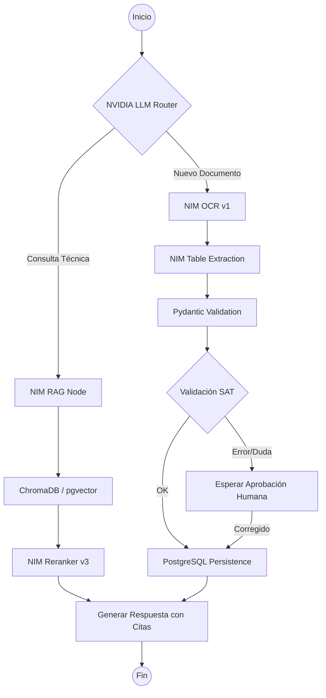

# Documento 3: Diagramas de Arquitectura Detallados y Modelo de Datos (PostgreSQL)

Este documento traduce la visión conceptual a una implementación técnica de bajo nivel. Se centra en la **orquestación de estados** y la **integración multi-inquilino (multi-tenancy)**.

## 1. Grafo de Orquestación: El "Cerebro" (LangGraph)

A diferencia de un flujo lineal, el asistente utiliza un grafo cíclico donde el LLM puede retroceder o saltar entre nodos según la necesidad del proceso contable.

Fragmento de código



------

## 2. Diseño de Base de Datos (PostgreSQL Multi-tenant)

Se utilizará una arquitectura de **esquemas aislados por tenant** o una **columna de discriminación (`tenant_id`)** con Row Level Security (RLS) para máxima seguridad.

### A. Tabla: `tenants` (Despachos/Empresas)

Define quién es el dueño de la información y sus límites de consumo.

SQL

```
CREATE TABLE tenants (
    id UUID PRIMARY KEY DEFAULT gen_random_uuid(),
    name VARCHAR(255) NOT NULL,
    rfc VARCHAR(13) UNIQUE NOT NULL,
    plan_tier ENUM('standard', 'enterprise') DEFAULT 'standard',
    api_key_vault_ref VARCHAR(255), -- Referencia a Keytar/Vault para credenciales SAT
    created_at TIMESTAMP WITH TIME ZONE DEFAULT NOW()
);
```

### B. Tabla: `documents` (Repositorio Central de IDP)

Almacena el resultado de la extracción de NVIDIA NIM y la metadata fiscal.

SQL

```
CREATE TABLE documents (
    id UUID PRIMARY KEY DEFAULT gen_random_uuid(),
    tenant_id UUID REFERENCES tenants(id),
    file_path_s3 VARCHAR(512),
    doc_type ENUM('xml_cfdi', 'pdf_invoice', 'bank_statement', 'tax_id'),
    status ENUM('pending', 'processed', 'error', 'flagged'),
    
    -- Metadata extraída por IA
    extraction_json JSONB, -- Resultado completo de NIM OCR
    total_amount DECIMAL(15, 2),
    currency VARCHAR(3) DEFAULT 'MXN',
    uuid_sat VARCHAR(36) UNIQUE,
    rfc_emisor VARCHAR(13),
    
    -- Clasificación
    clv_prod_serv VARCHAR(20),
    deducibility_score FLOAT,
    accounting_account_suggested VARCHAR(50),
    
    created_at TIMESTAMP WITH TIME ZONE DEFAULT NOW()
);
```

### C. Tabla: `audit_logs` (Trazabilidad de la IA)

Crítico para entender por qué la IA tomó una decisión (Deducibilidad/Clasificación).

SQL

```
CREATE TABLE ai_audit_logs (
    id SERIAL PRIMARY KEY,
    document_id UUID REFERENCES documents(id),
    agent_name VARCHAR(100), -- ej. 'IDP-Classifier'
    prompt_version VARCHAR(50),
    input_tokens INTEGER,
    output_tokens INTEGER,
    reasoning_path TEXT, -- El "pensamiento" del modelo
    user_override BOOLEAN DEFAULT FALSE -- Si el contador corrigió a la IA
);
```

------

## 3. Especificación de la API (Endpoints Core)

El backend de FastAPI expondrá los siguientes servicios para que el Coding Agent pueda conectarlos al frontend.

| **Método** | **Endpoint**                | **Módulo IA**  | **Descripción**                                              |
| ---------- | --------------------------- | -------------- | ------------------------------------------------------------ |
| **POST**   | `/v1/chat/stream`           | **RAG / Core** | Streaming de tokens (SSE) para el chat central.              |
| **POST**   | `/v1/idp/upload`            | **IDP**        | Recibe archivos, dispara el worker de NIM OCR asíncronamente. |
| **GET**    | `/v1/idp/validate/{uuid}`   | **Agente SAT** | Consulta el estado del CFDI directamente en el SAT.          |
| **POST**   | `/v1/predict/cashflow`      | **Predictivo** | Ejecuta análisis de series de tiempo sobre PostgreSQL.       |
| **PATCH**  | `/v1/documents/{id}/review` | **Human-Loop** | El contador confirma o corrige la extracción de la IA.       |

------

## 4. Comunicación entre Procesos (IPC y WebSockets)

Para la versión de escritorio o web, la comunicación debe ser asíncrona para no congelar la UI durante procesos pesados de IA.

1. **Frontend (React):** Envía documento vía multipart/form-data.
2. **Backend (FastAPI):** Retorna `202 Accepted` con un `task_id`.
3. **Worker (Celery/Redis):** Llama al microservicio **NVIDIA NIM OCR**.
4. **WebSocket:** Una vez terminada la extracción, el backend envía un evento `DOCUMENT_PROCESSED` al frontend para refrescar el dashboard en tiempo real.

------